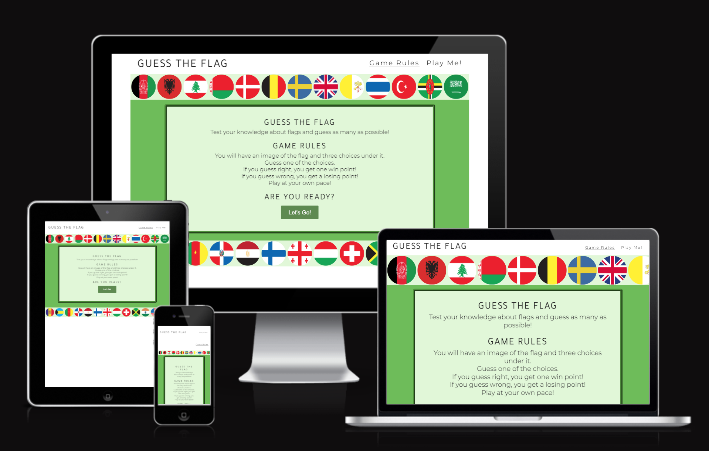

# Portfolio Project 2 - Guess The Flag
## Purpose
For people who love flags, inspired by "Big bang theory" series, this is a simple quiz to test the knowledge in flags.

This Website was created for the purpose of completing the Project 2 for the Code Institute's Full Stack Developer course and is entirely fictional. The project covers HTML, CSS and Javascript with a user centric approach in mind. A full list of technologies used can be found in the technologies section of this document.

The live website can be found [here](https://jnehmeh87.github.io/Project_Two/)

## Guess The Flag Responsive Website

*** 
## User Experience (UX)

### User stories

#### First Time Visitor Goals
* 
* 
* 

#### Returning Visitor Goals
* 
#### Frequent Visitor Goals
* 

### Design

#### Color Scheme
The Index page contains a start image sided with a circle with some convincing infortiom about the course. The color scheme consists of 2 colors rgba(34, 26, 107, 0.856) and rgba(153, 144, 235, 0.7).

#### Imagery
	

#### Typography
Tajawal and Montserrat from Google Fonts are used, with Sans Serif as fallback font.

#### Differences to Design
* The High Scores button on index page send us to the scores page to check players Highest scores. 
* Icons from font awesome were added to the footer, form and time section, this displayed more visually pleasing, while maintaining the visual cue for expected form contents.
* Header was split in 2 rows for mobile devices to keep visual integrity and readibility of header and navbar.

### Structure 
* 

No submenues are used and the navbar indicates to the user where they are at all times. THe Home page and courses page has direct links to the call to action - i.e. the book page.

### Wireframes

## Features
* Internal links (within sheet and between sheets) - both in nav bar and on the sheets
* External links (social media)
* Images

### Future features
* More challenges and different games

## Technologies
### Languages used
* HTML5
	* This project uses HTML5 as the main language for content and structure of the Website.
* CSS3
	* This project uses CSS3 for Website styling

### Frameworks, Libraries & Programs used
* [Font Awesome](https://fontawesome.com/)
	* Font awesome Icons are used 
* [Google Fonts](https://fonts.google.com/)
	* Google fonts are used throughout the project to import the relevant fonts
* [GitHub](https://github.com/)
	* GithHub is the hosting site used to store the source code for the Website and [Git Pages](https://pages.github.com/) is used for the deployment of the live site.
* [GitPod](https://gitpod.io/)
	* GitPod is used as version control software to commit and push code to the GitHub repository where the source code is stored.
* [Google Chrome Developer Tools](https://developers.google.com/web/tools/chrome-devtools)
	* Google chromes built in developer tools are used to inspect page elements and help debug issues with the site layout and test different CSS styles.
* [Am I Responsive?](http://ami.responsivedesign.is/)
	* Used to generate the screenshots for responsive design.

## Testing

### Validation

### Bugs
* 

## Deployment
### GitHub Pages

The project was deployed to GitHub Pages through the below steps:

1. Log in to GitHub and locate the [GitHub Repository](https://github.com/jnehmeh87/Project_Two)
2. Click the "Setting" button "Settings" Button.
3. In the left menu, scroll down to "Pages".
4. Under "Source", click the dropdown and select "Branch: main/master", then click "Save".
5. Once deployed, the now published site [link](https://jnehmeh87.github.io/Project_Two/) is found in the "Pages" section.

## Credits
### Images
*  https://www.worldometers.info/geography/flags-of-the-world/

### Acknowledgements

-   To my Mentor [Chris Quinn](https://github.com/10xOXR) the best tutor I received in years. Very helpful and pushing me to be best. Definitly recommend for all.
