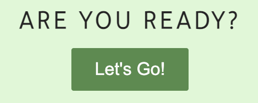

# Portfolio Project 2 - Guess The Flag
## Purpose
For people who love flags, inspired by "Big bang theory" series, this is a simple quiz to test the knowledge in flags.

This Website was created for the purpose of completing the Project 2 for the Code Institute's Full Stack Developer course and is entirely fictional. The project covers HTML, CSS and Javascript with a user centric approach in mind. A full list of technologies used can be found in the technologies section of this document.

The live website can be found [here](https://jnehmeh87.github.io/Project_Two/)

## Guess The Flag Responsive Website

The wireframe can be found [here](assets/images/wireframe.jpg)

*** 
## User Experience (UX)
The user can read the Game rules, start the game with a button linking to the play page. A variety of flags is represented in a rectangular box. The player will be asked to enter their name to make it a personal experience. Three buttons are the choices provided with each flag and by choosing write or wrong, the score box shows the result. Either winning more or losing more. By the end of the dictionnary of flags, another alert will Thank the user for playing, showing their winning score.

### User stories
* As a user, I want to be able to read the rules of the game
* As a user, I want to be able to play the game, knowing the results continuously
* As a user, I want to be able to play the game with my own name

#### First Time Visitor Goals
* Have a clear idea about the game
* having a link taking the user directly to the game
* The user will be challenged with their knowledge of flags

#### Returning Visitor Goals
* The user haven't guessed all flags, and they want to test their knowledge again

#### Frequent Visitor Goals
* It will be their gret way to memories all flags

### Design

#### Color Scheme
The Index page contains the game rules in a box with a button linking to the game page. One box that shows the flag and three to show the choices and the score is in the bottom of the page before the footer. The last is in all pages . The color scheme consists of 2 colors rgb(76, 145, 55) and rgba(165, 235, 144, 0.7).

#### Imagery
Iamges are uploaded to the repositary and can be found in the images folder in assets.

#### Typography
Tajawal and Montserrat from Google Fonts are used, with Sans Serif as fallback font.

#### Differences to Design
* The High Scores button on index page is removed
* I decided to remove the the High score page

### Structure 
* No submenues are used and the navbar indicates to the user where they are at all times. THe Home page and Play page has direct links to the call to action - i.e. the play page.

### Wireframes

## Features
* The user Find the game rules on the first page

* Internal links (within pages and between pages) - both in nav bar and on the pages. Let's go button take us to the play page

* Onload of the play game a prompt ask the user to enter their name, then a welcome message shows on the top of the page

* Then we can see the box where the flag changes with every choice of the use

* Every time the user choose a name of the flag, then a point will be added to his win or loss

### Future features
* More flags can be added
* High score page
* Creating sections with different quiz and flags, other than countries

## Technologies
### Languages used
* HTML5
	* This project uses HTML5 as the main language for content and structure of the Website.
* CSS3
	* This project uses CSS3 for Website styling
* Javascript
	* This project uses Javascript to create dynamic and interactive web content

### Frameworks, Libraries & Programs used
* [Font Awesome](https://fontawesome.com/)
	* Font awesome Icons are used 
* [Google Fonts](https://fonts.google.com/)
	* Google fonts are used throughout the project to import the relevant fonts
* [GitHub](https://github.com/)
	* GithHub is the hosting site used to store the source code for the Website and [Git Pages](https://pages.github.com/) is used for the deployment of the live site.
* [GitPod](https://gitpod.io/)
	* GitPod is used as version control software to commit and push code to the GitHub repository where the source code is stored.
* [Google Chrome Developer Tools](https://developers.google.com/web/tools/chrome-devtools)
	* Google chromes built in developer tools are used to inspect page elements and help debug issues with the site layout and test different CSS styles.
* [Am I Responsive?](http://ami.responsivedesign.is/)
	* Used to generate the screenshots for responsive design.

## Testing

### Validation
The W3C Markup Validator and W3C CSS Validator Services were used to validate every page of the project. All pages of the final website passed validation without errors.

W3C Markup Validator for index
W3C Markup Validator for play
W3C Jigsaw CSS Validator
JSHint

### Bugs
* The flag stripe had an ID duplicated on the top and bottom level, I switched them to a class instead and fixed that in the css

## Deployment
### GitHub Pages

The project was deployed to GitHub Pages through the below steps:

1. Log in to GitHub and locate the [GitHub Repository](https://github.com/jnehmeh87/Project_Two)
2. Click the "Setting" button "Settings" Button.
3. In the left menu, scroll down to "Pages".
4. Under "Source", click the dropdown and select "Branch: main/master", then click "Save".
5. Once deployed, the now published site [link](https://jnehmeh87.github.io/Project_Two/) is found in the "Pages" section.

## Credits
### Images
*  https://www.worldometers.info/geography/flags-of-the-world/

### Acknowledgements

-   To my Mentor [Chris Quinn](https://github.com/10xOXR) the best tutor I received in years. Very helpful and pushing me to be best. Definitly recommend for all.
